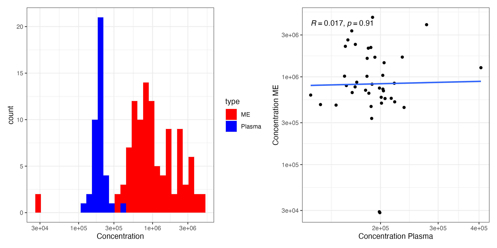
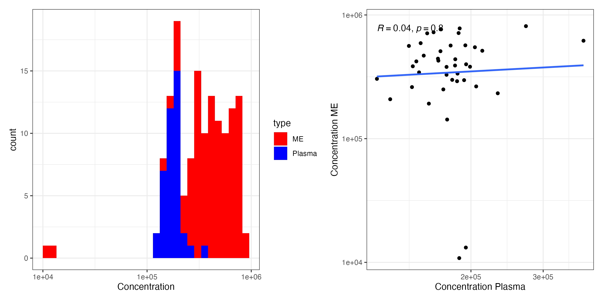
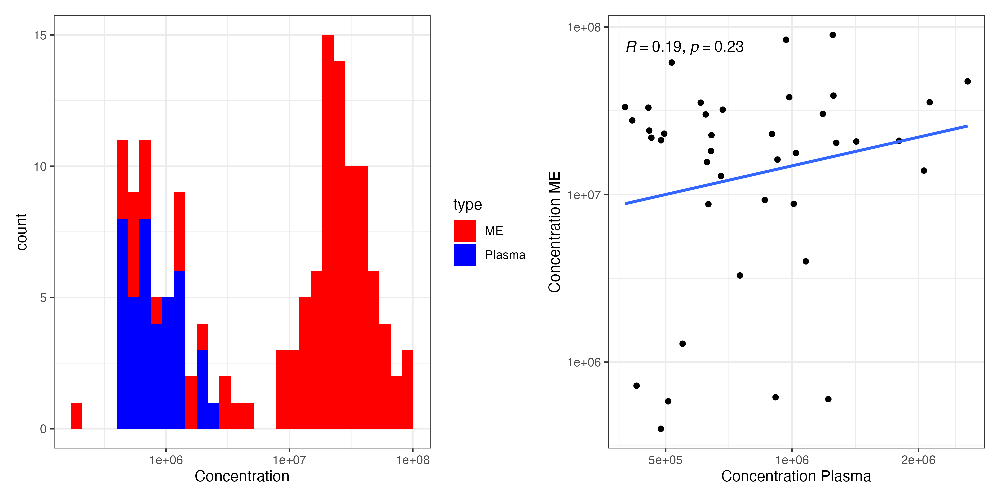
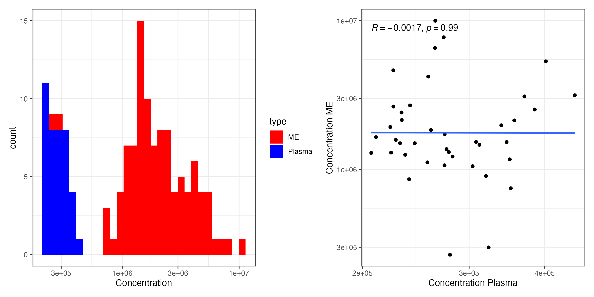

## Valine


```{r} 
knitr::include_graphics("img/interval_1.png") 
 
``` 

## Isoleucine


```{r} 
knitr::include_graphics("img/interval_2.png") 
 
``` 

## Lactate


```{r} 
knitr::include_graphics("img/interval_3.png") 
 
``` 


## Alanine


```{r} 
knitr::include_graphics("img/interval_4.png") 
 
``` 